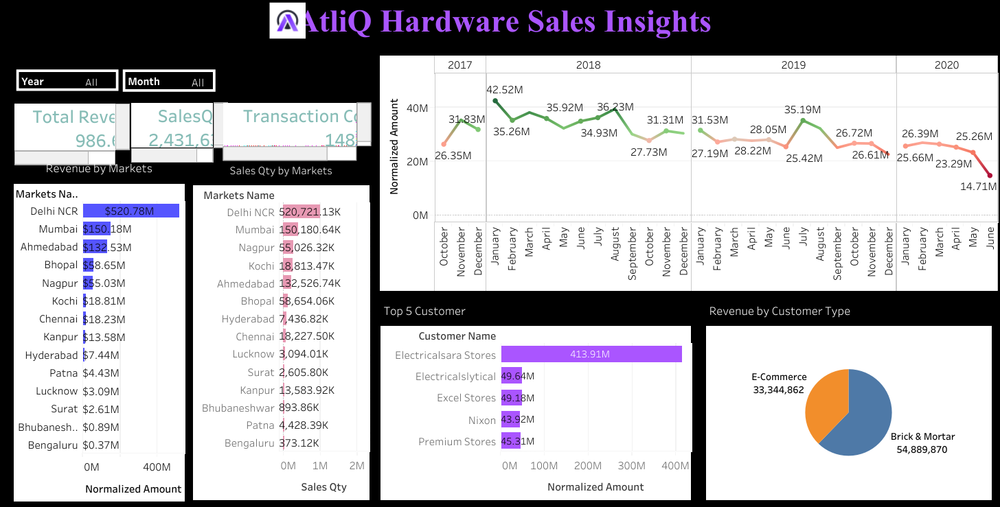

# AtliQ_Sales_Insights

&nbsp;

## Overview

This repository contains a Tableau dashboard that provides insights into  AtliQ Hardware sales analytics. This dashboard provides a comprehensive view of AtliQ Hardware's sales performance across various dimensions. It allows for analysis of total revenue, sales quantity, and transaction count over time and across different markets. Key areas of focus include market-wise performance, sales trends by month and year, top-performing customers, and revenue distribution by customer type. The interactive filters for "Year" and "Month" enable granular exploration of the data.

## Dataset

The analysis in this project is based on the AtliQ dataset. The dataset includes Customers,Product,Dates,Markets and Transaction data, which were used to generate insights.

## Tool used :
&nbsp;

## Key Insights

### Storytelling with Tableau

This dashboard highlights key business insights through data storytelling. The following stories emerge from the analysis:

1.Dominant Markets: Delhi NCR and Mumbai consistently lead in both revenue and sales quantity, indicating strong market penetration in these regions.

2.Key Customer Reliance: A significant portion of revenue comes from the top two customers, Electricalsara and Electricalsystical, highlighting customer concentration.

3.Channel Performance: Brick & Mortar and E-Commerce are the primary revenue-generating customer types, underscoring the importance of these channels.
  
  ## These insights help businesses identify high-performing areas and make strategic decisions based on real data.

1)Revenue Concentration: Delhi NCR consistently generates the highest revenue compared to other markets.

2)Sales Quantity Leadership: Delhi NCR also leads in terms of the quantity of products sold.

 3)Transaction Volume: The transaction count shows fluctuations over time, with a noticeable peak around the end of 2018 and the beginning of 2019.
 
4)Seasonal Trends: The "Normalized Amount" trend chart over the years suggests potential seasonal patterns in sales, though a clearer pattern would require more detailed analysis.

5) Top Customers: Electricalsara and Electricalsystical are the top two customers by normalized sales amount, significantly outperforming others.

6)Revenue by Customer Type: Brick & Mortar and E-Commerce customer types contribute the most to the overall revenue, with Electrical Stores also being a 
   significant contributor.
   
7) Yearly Comparison: Revenue appears to have generally declined from 2017 to 2020 based on the trend chart.
Data Processing

## Data Processing
1.Data Aggregation: The raw transaction data has been aggregated to calculate total revenue, sales quantity, and transaction count at different levels (market, time).

2.Normalization (Implied): The term "Normalized Amount" in some charts suggests a potential standardization or scaling of the sales data for comparison purposes. 

3.The specific method of normalization isn't evident.

4.Filtering and Grouping: The dashboard allows for filtering by year and month, indicating that the underlying data supports these operations. Data is also grouped 
   by market, customer, and customer type for the various visualizations.
   
5.Time Series Analysis: The trend chart implies that the data has been processed to analyze sales performance over time.

## Usage

•	This Tableau dashboard helps businesses analyze sales trends and profitability.

•	The insights can guide strategic decisions such as regional investments, discount policies, and category prioritization.

## Dashboard :
&nbsp;

## Story Telling :

&nbsp;
